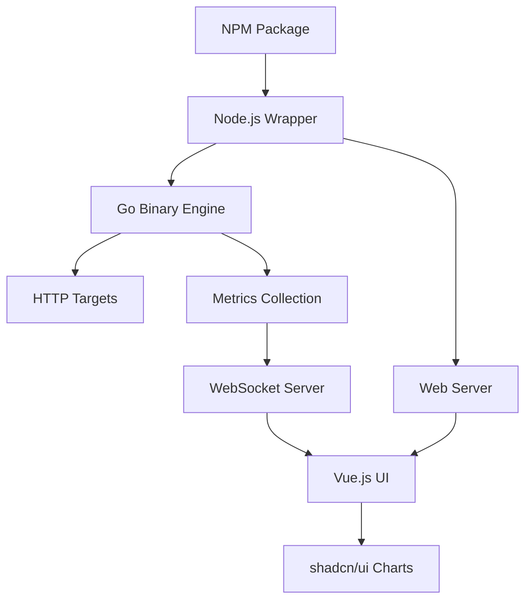
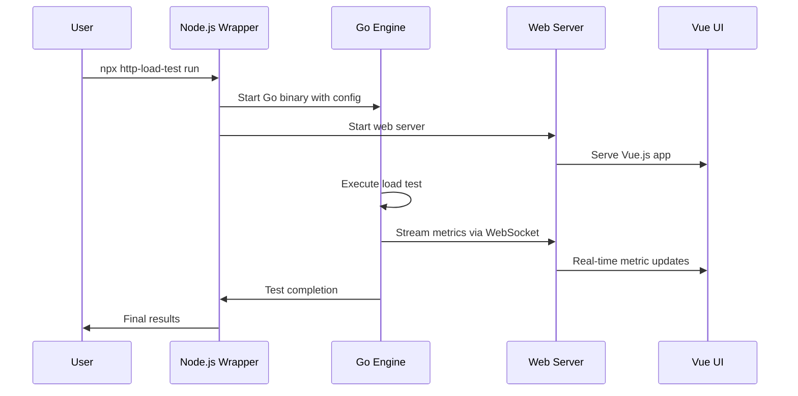

# Design Document

## Overview

The refactored HTTP load testing library will follow a hybrid architecture combining a high-performance Go engine with a Node.js wrapper and Vue.js web interface. The system maintains backward compatibility while providing enhanced performance and visualization capabilities.

### Key Design Principles
- **Performance First**: Go engine handles all HTTP requests and timing measurements
- **Seamless Integration**: Node.js wrapper provides familiar API and package management
- **Modern UI**: Vue.js with Tailwind and shadcn/ui for professional visualization
- **Cross-Platform**: Automatic binary distribution for Windows, macOS, and Linux
- **Real-time Updates**: WebSocket communication for live metrics during tests

## Architecture

### High-Level Architecture



### Component Interaction Flow



## Components and Interfaces

### 1. Node.js Wrapper (`index.js`)

**Responsibilities:**
- Maintain backward-compatible API
- Manage Go binary lifecycle
- Handle binary distribution and updates
- Coordinate between Go engine and web interface

**Key Methods:**
```javascript
class HttpLoadTest {
  constructor(config)           // Parse and validate configuration
  startTest()                  // Launch Go engine and web interface
  setRequestSuccessChecker()   // Pass success logic to Go engine
  setDynamicDataFunction()     // Configure dynamic data generation
}
```

**Binary Management:**
- Check for existing Go binary in `node_modules/.bin/`
- Download platform-specific binary on first run
- Verify binary integrity and version compatibility
- Handle automatic updates

### 2. Go Engine (`cmd/http-load-test/main.go`)

**Responsibilities:**
- Execute high-performance HTTP load testing
- Calculate detailed performance metrics
- Stream real-time results via WebSocket
- Handle concurrent request management

**Core Modules:**

#### HTTP Client Module
```go
type HTTPClient struct {
    client     *http.Client
    config     *TestConfig
    metrics    *MetricsCollector
}

func (c *HTTPClient) ExecuteRequest(ctx context.Context) *RequestResult
```

#### Metrics Collection Module
```go
type MetricsCollector struct {
    responseTimes    []time.Duration
    statusCodes      map[int]int
    errors           []error
    startTime        time.Time
    mutex            sync.RWMutex
}

func (m *MetricsCollector) CalculatePercentiles() PercentileMetrics
func (m *MetricsCollector) GetRealTimeStats() RealtimeStats
```

#### WebSocket Server Module
```go
type MetricsStreamer struct {
    connections map[string]*websocket.Conn
    metrics     *MetricsCollector
}

func (s *MetricsStreamer) BroadcastMetrics(stats RealtimeStats)
```

### 3. Web Server (`internal/server/server.go`)

**Responsibilities:**
- Serve Vue.js application
- Handle WebSocket connections for real-time metrics
- Provide REST API for test configuration and results
- Manage static asset serving

**API Endpoints:**
- `GET /` - Serve Vue.js application
- `GET /api/status` - Current test status
- `GET /api/results` - Final test results
- `POST /api/export` - Export results (JSON/CSV)
- `WS /ws/metrics` - Real-time metrics stream

### 4. Vue.js Frontend (`web/src/`)

**Component Structure:**
```
src/
├── components/
│   ├── MetricsDashboard.vue    # Main dashboard layout
│   ├── RealtimeChart.vue       # Live response time chart
│   ├── PercentileMetrics.vue   # P50, P95, P99 display
│   ├── ErrorSummary.vue        # Error categorization
│   └── ExportControls.vue      # Export functionality
├── composables/
│   ├── useWebSocket.js         # WebSocket connection management
│   ├── useMetrics.js           # Metrics data processing
│   └── useCharts.js            # Chart configuration
└── stores/
    └── metrics.js              # Pinia store for metrics state
```

**Key Features:**
- Real-time chart updates using shadcn/ui Chart components
- Responsive design with Tailwind CSS
- Dark/light theme support
- Export functionality for results

## Data Models

### Test Configuration
```go
type TestConfig struct {
    URL                string            `json:"url"`
    Method             string            `json:"method"`
    Headers            map[string]string `json:"headers"`
    Body               string            `json:"body"`
    TotalRequests      int               `json:"totalRequests"`
    RequestsPerSecond  int               `json:"requestsPerSecond"`
    ConcurrentRequests int               `json:"concurrentRequests"`
    Timeout            time.Duration     `json:"timeout"`
    SuccessChecker     string            `json:"successChecker"` // JavaScript function as string
    DynamicDataFunc    string            `json:"dynamicDataFunc"` // JavaScript function as string
}
```

### Request Result
```go
type RequestResult struct {
    StartTime    time.Time     `json:"startTime"`
    EndTime      time.Time     `json:"endTime"`
    Duration     time.Duration `json:"duration"`
    StatusCode   int           `json:"statusCode"`
    Success      bool          `json:"success"`
    Error        string        `json:"error,omitempty"`
    ResponseSize int64         `json:"responseSize"`
}
```

### Metrics Summary
```go
type MetricsSummary struct {
    TotalRequests     int                    `json:"totalRequests"`
    SuccessfulReqs    int                    `json:"successfulRequests"`
    FailedRequests    int                    `json:"failedRequests"`
    Duration          time.Duration          `json:"duration"`
    RequestsPerSecond float64               `json:"requestsPerSecond"`
    Percentiles       PercentileMetrics     `json:"percentiles"`
    StatusCodes       map[int]int           `json:"statusCodes"`
    Errors            map[string]int        `json:"errors"`
    ResponseTimes     ResponseTimeMetrics   `json:"responseTimes"`
}

type PercentileMetrics struct {
    P50 time.Duration `json:"p50"`
    P95 time.Duration `json:"p95"`
    P99 time.Duration `json:"p99"`
    Min time.Duration `json:"min"`
    Max time.Duration `json:"max"`
    Avg time.Duration `json:"avg"`
}
```

## Error Handling

### Go Engine Error Handling
- **Network Errors**: Categorize by type (timeout, connection refused, DNS failure)
- **HTTP Errors**: Track by status code with detailed error messages
- **Configuration Errors**: Validate all inputs before test execution
- **Resource Errors**: Handle memory and file descriptor limits gracefully

### Node.js Wrapper Error Handling
- **Binary Management**: Clear error messages for download/execution failures
- **Process Communication**: Handle Go process crashes and restarts
- **Configuration Validation**: Validate user inputs before passing to Go engine

### Frontend Error Handling
- **WebSocket Disconnection**: Automatic reconnection with exponential backoff
- **Data Processing Errors**: Graceful handling of malformed metrics data
- **Chart Rendering**: Fallback displays when chart data is unavailable

## Testing Strategy

### Unit Testing

#### Go Engine Tests
```go
// Test HTTP client functionality
func TestHTTPClient_ExecuteRequest(t *testing.T)
func TestMetricsCollector_CalculatePercentiles(t *testing.T)
func TestWebSocketStreamer_BroadcastMetrics(t *testing.T)
```

#### Node.js Wrapper Tests
```javascript
// Test API compatibility
describe('HttpLoadTest', () => {
  test('should maintain backward compatibility')
  test('should handle Go binary management')
  test('should validate configuration')
})
```

#### Vue.js Component Tests
```javascript
// Test UI components
describe('MetricsDashboard', () => {
  test('should render metrics correctly')
  test('should handle real-time updates')
  test('should export data properly')
})
```

### Integration Testing

#### End-to-End Test Flow
1. **Package Installation**: Test NPM package installation and binary download
2. **API Compatibility**: Verify existing configurations work unchanged
3. **Performance Testing**: Validate Go engine performance improvements
4. **UI Integration**: Test real-time metric streaming and visualization
5. **Cross-Platform**: Test on Windows, macOS, and Linux

#### Performance Benchmarks
- **Throughput**: Measure requests/second vs. current JavaScript implementation
- **Memory Usage**: Monitor memory consumption during high-load tests
- **Accuracy**: Verify timing precision and metric calculations
- **Scalability**: Test with various concurrent request levels

### Mock Testing Environment

#### Test Server Setup
```javascript
// Express server for testing HTTP endpoints
const testServer = express()
testServer.post('/test', (req, res) => {
  // Configurable response times and status codes
  setTimeout(() => res.status(200).json({success: true}), req.query.delay || 0)
})
```

#### Automated Test Scenarios
- **Basic Load Test**: Simple GET requests with various configurations
- **Complex Scenarios**: POST requests with dynamic data and custom success checkers
- **Error Conditions**: Network failures, timeouts, and server errors
- **Performance Validation**: Verify percentile calculations and real-time updates

## Implementation Considerations

### Binary Distribution Strategy
- Use GitHub Releases for hosting platform-specific binaries
- Implement checksum verification for security
- Support automatic updates with version checking
- Fallback to compilation from source if binary unavailable

### Performance Optimizations
- **Connection Pooling**: Reuse HTTP connections for better performance
- **Memory Management**: Efficient handling of large result datasets
- **Concurrent Processing**: Optimal goroutine management for request execution
- **Data Streaming**: Minimize memory usage with streaming metrics updates

### Security Considerations
- **Input Validation**: Sanitize all user inputs before processing
- **Binary Verification**: Verify Go binary integrity and authenticity
- **WebSocket Security**: Implement proper CORS and origin validation
- **Data Export**: Secure handling of sensitive data in exports

### Deployment and Distribution
- **NPM Package**: Maintain existing package structure and metadata
- **Binary Assets**: Automated build pipeline for cross-platform binaries
- **Version Management**: Coordinated versioning between Node.js and Go components
- **Documentation**: Comprehensive migration guide and API documentation